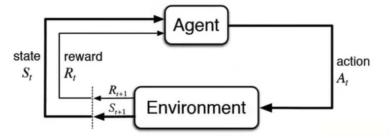
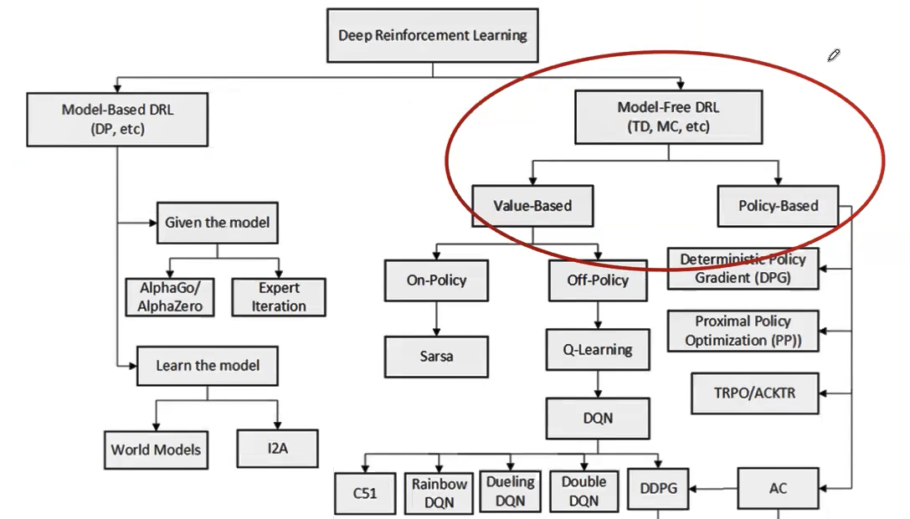
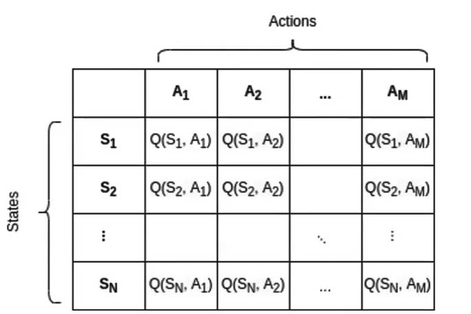

## My revision for Reinforcement Learning course designed by AI VIETNAM

An agent at the state $S_t$ receiving reward $R_t$ take an action $A_t$, and thus the agent get reward $R_{t+1}$ and move to state ${S_t+1}$ 

The Deep Reinforcement Learning (DRL) consist of 2 main types. One of those is Model-Free DRL, including Value-based and Policy-based RL. This is two subtypes that we study in this course. 

**Problem 1:**  
In the problem, we utilize **Q-Learning** algorithm, one of the subtypes of Value-based RL.   
For Q-Learning algorithm, we aim to train a **Q-function** to achieve the optimal Q-Table, thus optimal policy.  

Formula us used to update the Q-value:  
$Q\left(S_t, A_t\right)=Q\left(S_t, A_t\right)+\alpha\left[R_{t+1}+\gamma \max _a Q\left(S_{t+1}, a\right)-Q\left(S_t, A_t\right)\right]$

