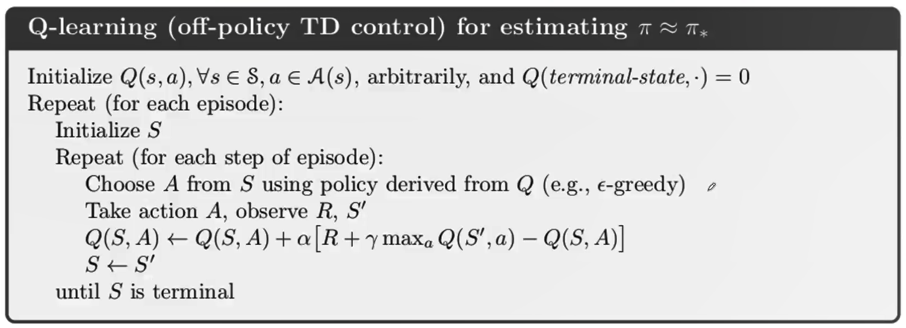
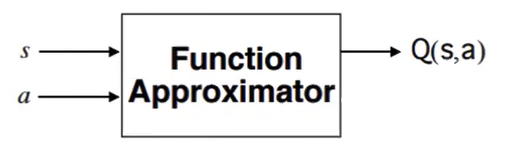
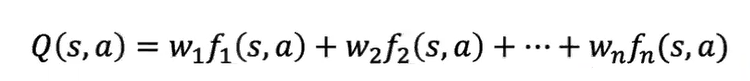
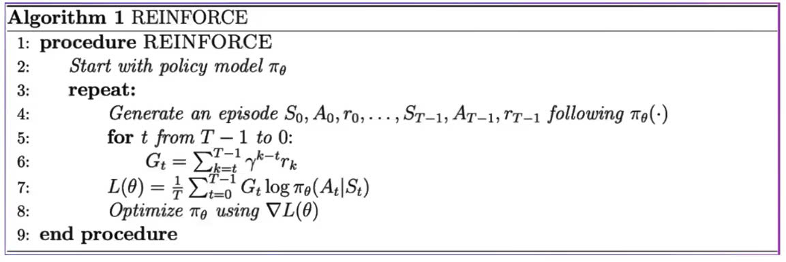

## My revision for Reinforcement Learning course designed by AI VIETNAM

An agent at the state $S_t$ receiving reward $R_t$ take an action $A_t$, and thus the agent get reward $R_{t+1}$ and move to state $S_{t+1}$ 

The Deep Reinforcement Learning (DRL) consist of 2 main types. One of those is Model-Free DRL, including Value-based and Policy-based RL. These are two subtypes that we study in this course. 

### Problem 1:
In the problem, we utilize **Q-Learning** algorithm, one of the subtypes of Value-based RL.   
For Q-Learning algorithm, we aim to train a **Q-function** to achieve the optimal Q-Table, thus optimal policy.  

Formula is used to update the Q-value:  
$Q(S_t, A_t) = Q(S_t, A_t) + \alpha [R_{t+1} + \gamma. \underset{a}{max}. Q(S_{t+1}, a) - Q(S_t, A_t)]$
In this problem, there are 6 actions and 500 state  

Q-Learning's pseudo code:

### Problem 2:
In the problem, we apply **Approximate Q-Learning** algorithm, which utilizes a function approximator instead of a Q-Table  

A Q-Function Approximator is represeted by:  

### Problem 3:
The problem is diffent from previous problems because this one includes a stochastic environment with discrete actions.  
Especially, we use policy $\pi _{\theta}$ as a neural network, with $\theta$ being the parameter 

